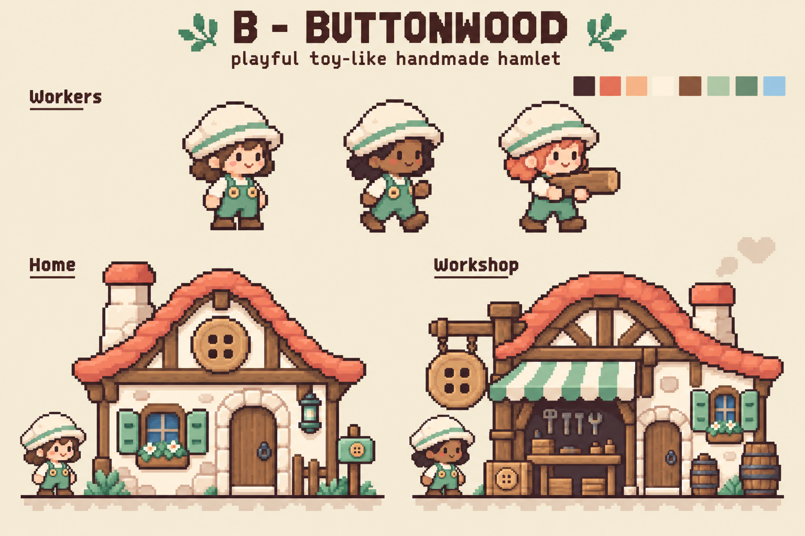
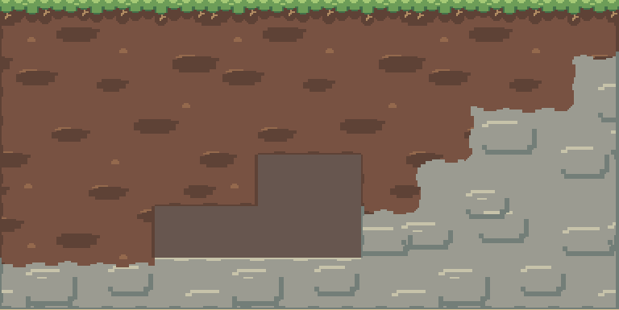
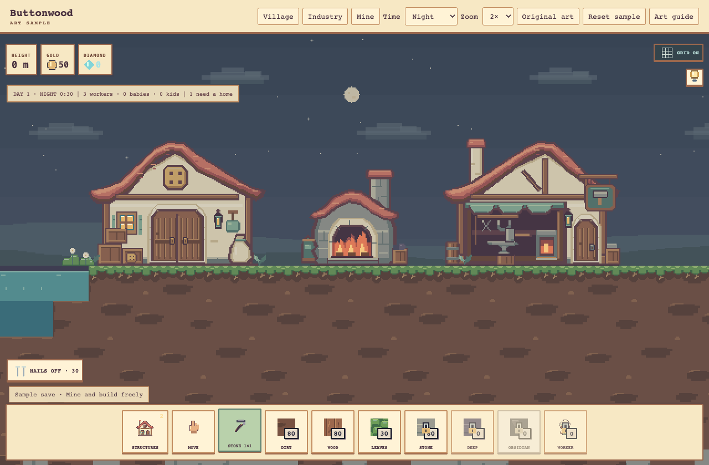
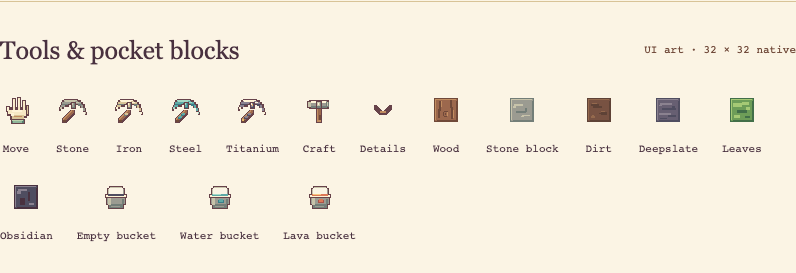

# Buttonwood art bible

**Tower of Babel · Visual direction v1.0 · September 26, 2026**

## Start here

**A handmade world you can understand one block at a time, inhabited by little
people with impossibly large ambitions.**

Terraria is our reference for exceptional 2D pixel-art craft: atmosphere, layered
places, purposeful detail, and life at a tiny scale. Minecraft is our reference
for a world whose materials and construction make sense through blocks. Buttonwood
is our identity: broad cream hats, mint workwear, coral roofs, warm timber, rich
loam, and a settlement that feels worth caring about.

Think **2D Minecraft in its construction logic, with Terraria's visual richness
and Buttonwood's own handmade warmth.** Terraria itself is tile based; this
comparison assigns creative emphasis, rather than claiming the games use opposing
world structures. We borrow principles and make original art.



*The approved concept is the identity anchor. It is concept art, not a sprite
sheet or a source to downsample. Native assets in the gallery set production scale.*

### Authority and use

Read this bible **before every new or changed visual**, including icons, controls,
HUD, menus, tutorials, effects, promotional scenes, and temporary placeholders.
Read the relevant family section and compare against the approved native gallery
before drawing. Include the sections used in the change's review notes.

| Reference | What it owns |
|---|---|
| **This bible** | Creative direction, visual rules, UI language, and acceptance criteria for new work. |
| [Native art guide](ART-GUIDE.md) | Exact current dimensions, anchors, schedules, rendering interfaces, and compatibility details. |
| [Shared palette](palette.js) and [sky palette](sky.js) | Executable color and timing values. Never invent near-duplicate hex colors in a family. |
| [Approved concept](reference/buttonwood-approved.png) and [native gallery](index.html) | Identity reference and actual authored pixels. |
| [Migration inventory](INVENTORY.md) | What exists, what is reviewed, and what is still inherited or deferred. |
| [QA record](qa/README.md) | Historical evidence, commands, and known limitations. |

The user’s explicit direction and repository instructions take precedence. This
bible extends the approved Buttonwood direction; it does not retroactively mark
legacy artwork as compliant or authorize changes to game rules. Technical facts
come from the implementation guide and source. Resolve a discrepancy explicitly
and update the affected documents together.

**Status language:** “Current” describes shipped or recorded artwork. “Standard”
sets the direction for new work. “Exploration” is a creative proposal, not a
shipped feature, approved asset, or development commitment. Unless marked otherwise,
the visual prescriptions below are standards. The
[illustrated PDF](art-bible/illustrated.pdf) is a dated reading companion; this
living file remains the full reference.

### The ten rules to keep beside the canvas

1. One world art pixel equals one world unit; one terrain cell is 32 × 32 units.
2. Draw every UI icon and building miniature separately on a 32 × 32 canvas;
   display it at native size. Building portraits retain native sprite dimensions.
3. Use the shared named palette and nearest-neighbor rendering.
4. Read silhouette, material, and function before ornament.
5. Keep solid block occupancy, support edges, and existing collision envelopes honest.
6. Put warm, rounded life inside a clear, modular world.
7. Group pixels into deliberate shapes; leave quiet space around useful information.
8. Let lighting and motion support actions without inventing simulation events.
9. Keep inventory/category panels adjacent to their toolbar triggers; keep the world usable.
10. Review at native size, in motion, in context, at night, and on a narrow phone.

### Contents

- [1. Identity and visual priorities](#1-identity-and-visual-priorities)
- [2. What we learn from the references](#2-what-we-learn-from-the-references)
- [3. Pixel grammar and scale](#3-pixel-grammar-and-scale)
- [4. Palette, materials, and contrast](#4-palette-materials-and-contrast)
- [5. Blocks, terrain, and construction](#5-blocks-terrain-and-construction)
- [6. Workers and character acting](#6-workers-and-character-acting)
- [7. Buildings and objects](#7-buildings-and-objects)
- [8. Landscape, depth, and light](#8-landscape-depth-and-light)
- [9. UI is part of the world](#9-ui-is-part-of-the-world)
- [10. Motion and effects](#10-motion-and-effects)
- [11. The world beyond the meadow](#11-the-world-beyond-the-meadow)
- [12. Authoring, review, and maintenance](#12-authoring-review-and-maintenance)
- [13. Research notebook](#13-research-notebook)

## 1. Identity and visual priorities

### The feeling

A small Workshop is busy before it is impressive. A Home looks sheltered before
it looks ornate. A mine is intriguing before it becomes threatening. The tower
grows from ordinary materials and collective work into something audacious. Keep
that human scale visible even as the ambitions become mythic.

The game premise is raising a tower toward heaven and ultimately declaring war
on God. Our visual arc starts in an affectionate settlement and grows toward awe.
Future danger may feel imposing, strange, or solemn; it should still belong to
the same material world. The current game focuses on mining, crafting, and tower
construction. Heavenly environments and adversaries are exploration only.

### Five design pillars

| Pillar | Visible decision | Failure to correct |
|---|---|---|
| **Legible construction** | Squared cells, trustworthy ledges, clear material transitions, useful placement feedback. | Scenery looks solid; a decorative curve implies support that is not there. |
| **Handmade warmth** | Broad hats, softened roof sweeps, stout timber, small asymmetries, welcoming openings. | Generic medieval props, sterile rectangles, or a button stamped on every surface. |
| **Purposeful richness** | Tools identify work; roots explain soil; soot explains a furnace. | Uniform noise, equal detail everywhere, random decorations. |
| **Small living stories** | A blink, an anvil stroke, a lit window, a carrying pose. | Constant bobbing or unrelated loops that imply nonexistent activity. |
| **Room for wonder** | Quiet negative space, receding landscapes, a height-driven change of mood. | Every inch crowded; spectacle obscures the next block or Worker. |

For any conflict, prioritize **interaction truth, readability, shared scale,
Buttonwood identity, then decorative richness**, in that order. A beautiful
texture that conceals an ore vein needs revision.

### Composition at three distances

At tower distance, read the main construction silhouette and the terrain horizon.
At settlement distance, read building functions, doors, Workers, and routes. At
inspection distance, enjoy shutters, tools, buttons, roots, and small expressions.
An asset must work at its intended gameplay distance before it earns extra detail.

Concentrate visual contrast at the current action and useful openings. Let broad
wall, soil, roof, and sky areas rest. UI should frame the playfield. Leave useful
space around the tower and above a Worker’s head; do not fill those areas simply
because the canvas is available.

## 2. What we learn from the references

These are selective studies, not instructions to imitate a game's assets. The
Terraria scene observations below are our analysis of Re-Logic’s published
screenshots; they are not claims about its internal production process.

| Study | Lesson | Buttonwood translation |
|---|---|---|
| **Terraria: built surface scenes** | Tiny furnishings and local lights make places feel inhabited; distant land separates from the playable plane. | Show a building’s job through its opening and one signature prop. Keep the backdrop quieter than Workers and usable terrain. |
| **Terraria: underground scenes** | Clear hot regions and dark surrounding masses give a cave both atmosphere and orientation. | Distinguish water, lava, solid terrain, and open cave space before adding cave decoration. |
| **Terraria: interface refinement** | Re-Logic describes clearer icon hover edges, bordered text/counts, and visible open-chest states. | Explicit hover, focus, selection, open, and depleted states; readable counts on a dependable backing. |
| **Minecraft: texture revision** | Lead artist Jasper Boerstra describes reducing excessive antialiasing and maintaining a coherent texture style. | Crisp edges and one pixel vocabulary across dirt, wood, tools, buildings, and UI. |
| **Minecraft: environments** | The developers describe using cave ceilings and the feeling of being under large vegetation. | Compose the whole cutaway: ceiling, walls, floor, and empty space. A cave is a place, not just a floor with props. |
| **Pixel-art craft** | Deliberate clusters, tile repetition, and held animation poses deserve separate study. | Inspect a tiled field and full motion cycle, not just a single appealing enlarged frame. |

Sources: [Re-Logic screenshot collection](https://store.steampowered.com/app/105600/Terraria/),
[Terraria UI development note](https://terraria.org/news/terraria-1-3-user-interface-upgrades),
[Mojang texture interview](https://www.minecraft.net/en-us/article/try-new-minecraft-textures),
and [Caves & Cliffs developer Q&A](https://www.minecraft.net/en-us/article/caves---cliffs--part-i--dev-q-a).
The [research notebook](#13-research-notebook) records further study and application.

Keep our proportions, palette, hat/roof language, material patterns, creatures,
and interface original. Do not trace a Terraria sprite, import Minecraft textures,
adopt their UI chrome, or add recognizable franchise objects as visual shorthand.
The brief is a coherent game with its own identity.

## 3. Pixel grammar and scale

### Production sizes

| Family | Native canvas / geometry | Anchor or display rule |
|---|---|---|
| Terrain and ore overlay | 32 × 32 | Exactly one cell; overlay registers to the same origin. |
| Adult Worker | 40 × 32 | Ground anchor `(18, 31)`; roughly 30 px tall; tool padding included. |
| Worker UI portrait | 32 × 32 | Separate composition at 1×. |
| Home / Workshop | 128 × 128 | Four cells wide and high; foundation anchored. |
| Storehouse / Blacksmith | 160 × 128 | Five cells wide, four high; same source pixel size. |
| Forge | 96 × 96 | Three cells wide and high; stays visibly compact. |
| All UI icons / building miniatures | 32 × 32 | Native 32 CSS px square canvas; no fractional resize. |
| Building portrait | Native world sprite size | Reflow its panel instead of shrinking the portrait. |
| Liquids | One art pixel per world unit | Existing solver cells stay 16 world units. |

Buildings’ canvas dimensions describe art allocation, not a replacement collision
definition. The cached `structureShapeV47` envelopes remain authoritative.

### How to place a pixel

- Start with a filled silhouette, establish the main light and shadow masses,
  then add only the details needed for identity and material.
- Use a one-pixel colored outer contour on foreground sprites. Use `outline` or
  a suitable material shadow. Reserve `ink` for eyes, deep openings, and essential
  separation. Adjacent cells of continuous terrain do not each get this contour.
- Draw stepped curves with an intentional rhythm. Keep a roof’s sweep smooth
  in pixel steps; remove accidental alternating bumps and stray corner pixels.
- Use connected clusters for volume. An isolated pixel must earn its place as an
  eye, fastener, star, glint, or similarly meaningful accent.
- Shade with broad base areas and smaller shadow/highlight clusters. Avoid pillow
  shading, universal black outlines, checkerboard dithering, and spray-noise texture.
- Keep ordinary sprite alpha binary: transparent or opaque. Deliberate light,
  scene washes, liquid compositing, and approved fades are renderer-level exceptions,
  not permission to antialias sprite edges.
- Draw objects at their final source size. Do not shrink painted concept art,
  rotate/resample a finished sprite to invent a pose, or mix chunky and fine pixels.

**Three-pass test:** silhouette only; flat material masses; final shaded sprite.
If function disappears in the first two passes, fix the drawing before adding detail.

### Rendering discipline

Use integer source coordinates and dimensions, disable image smoothing, and use
nearest-neighbor compositing. Review at 1×, then 2× or 3× for pixel inspection.
The normal camera may zoom fractionally, provided it transforms the complete
world uniformly. UI icons remain native sized. Device pixel ratio does not change
the authored canvas or the 32 CSS px UI contract.

Physics can translate or rotate a falling object; that is distinct from painting
blurred rotated source art. Do not round or reshape physics to repair an art seam.
Scenery is composited in a native pixel layer before camera scaling: the existing
[fractional-zoom seam fix](qa/README.md#bug-001--fractional-zoom-background-seams-september-17-2026)
must survive future background work.

## 4. Palette, materials, and contrast

The complete palette lives in [palette.js](palette.js); the
[native guide](ART-GUIDE.md#palette) lists its exact ramps. Use token names in
source. Three main shades per material are the normal starting point. Additional
colors require a shared palette change and a representative scene review.

### Color roles

| Role | Named colors | Use |
|---|---|---|
| Structure and legibility | `ink #49313f`, `outline #67434a` | Faces, critical separation, primary text, dark recesses. |
| Human warmth | `cream #f7e8c4`, `coral #d97d68`, `wood #9c684d` | Hats, plaster, roofs, frames, calm panel surfaces. |
| Work and care | `mint #8fb69a`, `mintShade #597d70`, `mintLight #b9d1ab` | Clothing, shutters, selected controls; selection also needs a shape/state cue. |
| Small rewards | `gold #e6b76c`, `goldShade #b58250` | Buttons, fasteners, resource accents; not a border around everything valuable. |
| Living ground | `dirt #785242`, `grass #6d9d58` | Rich soil with connected clumps and fuller green sod. |
| Hard ground | `stone #9b9b91`, `deep #675f72` | Broad stone planes; cooler, darker depth. |
| Liquid identity | `water #5eaaa6`, `lava #dd7958` | Turquoise water and orange/coral lava, also separated by shape and motion. |

Color communicates material first. Coral is already a roof color, so a coral tint
alone cannot mean danger. Mint alone cannot mean selection. Use a border, pixel
badge, posture, count, label, or distinct surface pattern as appropriate.

### Material recipes

| Material | Shape vocabulary | Light / texture treatment | Avoid |
|---|---|---|---|
| Soil | Wide irregular clumps, small roots | Low-contrast chocolate masses; warm highlights kept sparse | Sand-colored noise, cracks on every tile, repeated little diamonds |
| Stone | Broad angular planes | Short flat highlights and shallow material-colored cuts | Cobblestone outlining every cell; equal contrast on every pebble |
| Deepslate | Quiet layered planes | Cooler purple-gray ramp; more compressed value range | Making every deep tile nearly black or indistinguishable from cave air |
| Timber | Vertical or horizontal grain following construction | A few long broken marks and restrained knots | Grain flowing across unrelated boards or suggesting nonexistent beams |
| Plaster | Large uninterrupted cream planes | Shade under eaves and beside framing; occasional worn cluster | Salt-and-pepper wall noise or realistic mottling |
| Roof tile | Broad curved coral roof mass | Sparse stepped courses; strongest shadow under the eave | Individually outlined tiles swallowing the roof silhouette |
| Metal / ore | Compact angular facets or inclusions | A few bright hard glints; clear dark separation from host rock | Bright sparkling on every frame or color-only ore identification |
| Foliage | Rounded clusters supported by block occupancy | Dark interior masses, grouped lit tips | Independent random leaves or fronds that hide walkable edges |
| Water | Horizontal surface marks and quiet body | Restrained pale glints, turquoise depth | Busy caustics, soft photographic highlights, cell overlap seams |
| Lava | Broad warm body and irregular crust | Pale hot accents against darker crust | Looking like safe water with a hue swap |

Copper uses peach with restrained mint inclusions; iron uses pale warm inclusions;
coal uses dark charcoal masses. Preserve those identities and their existing
resources. In new ore designs, change inclusion shape as well as hue.

### Contrast has a job

The backdrop gets broad shapes and subdued contrast; playable terrain gets clear
boundaries; useful objects and characters get local separation; UI information
gets a stable opaque surface. Test the actual scene in grayscale, but retain
color review too: equal-luminance hues can hide important differences.

For new UI, target WCAG contrast thresholds of 4.5:1 for normal text and 3:1 for
large text and meaningful non-text control/state edges. These are design checks,
not a claim that the existing game has passed an accessibility audit.
[W3C text contrast](https://www.w3.org/WAI/WCAG22/Understanding/contrast-minimum.html),
[non-text contrast](https://www.w3.org/WAI/WCAG22/Understanding/non-text-contrast.html).

Measured opaque sRGB pairs from the current tokens:

| Pair | Ratio | Design decision |
|---|---:|---|
| `ink` on `cream` | 9.64:1 | Preferred body text and quantities. |
| `ink` on `mintLight` | 7.12:1 | Preferred text on selected rows. |
| `woodShade` on `cream` | 6.40:1 | Warm secondary text. |
| `outline` on `cream` | 6.98:1 | Strong panel/control outlines. |
| `mintShade` on `cream` | 3.77:1 | Useful control edge; insufficient for normal-sized text. |
| `coralShade` on `cream` | 3.99:1 | Accent with an accompanying readable label; insufficient for normal text. |
| `creamLight` on `mintShade` | 4.15:1 | Insufficient for normal text; do not assume a dark green button passes. |

These pairs are measured at full opacity. Compositing, disabled opacity, a world
background, or antialiased small text can reduce practical readability. Inherited
UI that uses weaker pairs is migration work; do not silently claim it is fixed.

## 5. Blocks, terrain, and construction

**The grid is a physical promise, not a decorative pattern.** Preserve its solid
cells, excavated voids, support, placement, and resource identities. A player
should be able to predict where a block goes and what holds it up.

### Softness inside a square world

Blocks establish structure. Organic clusters describe the material inside them.
Roots, edge bevels, and surface sod soften the presentation while leaving occupied
cells occupied. Same-material neighbors form a larger mass; the player does not
need a dark checkerboard outline to understand that the world is block based.

| Situation | Required visual treatment |
|---|---|
| Same-material neighbors | Continuous texture; no interior box borders or per-cell darkening. |
| Dirt / stone / deepslate boundary | One material owns each stepped join; paint inside occupied cells. |
| Convex or concave exposed corner | Deliberate corner treatment with no implied tunnel or missing collision. |
| Exposed surface dirt | Sod and roots only where meadow eligibility is real. |
| Newly excavated underground ledge | Bare soil; mining does not spontaneously grow meadow grass. |
| Grid-aligned, stationary placed body | May visually join through the existing visual neighbor index. |
| Falling, rotated, overlapping, or misaligned piece | Retain its own internal joins; do not visually glue it to unrelated terrain. |
| Grid overlay enabled | Clear optional placement aid, visually subordinate to content and selection. |

World-coordinate texture keeps patterns continuous; do not independently reseed
random noise per tile or per frame. Repeat inspection should include a wide field,
an isolated cell, a pillar, stairs, an overhang, a one-cell tunnel, an inside corner,
mixed materials, negative coordinates, and mining before/after states.

### Placement and interaction graphics

An art preview uses the real asset at world scale. A placement guide communicates
the current valid/invalid result from the game. Use a distinct contour/pattern or
pixel-art marker plus an accessible reason where applicable, alongside color.
Keep the block, foundation, neighboring support, and pointer visible. These are
standards for new preview work; inherited previews need their own migration.

Texture must not imply fake holes, side-facing cubes, bevelled isometric depth,
or extra traversable surfaces. A little side shade can describe thickness on a
tool; an entire isometric building would break the front-elevation language.



*Existing connected terrain evidence. The solid cutaway stays readable while
material texture crosses cell boundaries.*

## 6. Workers and character acting

Workers are capable adults expressed through chibi proportions. The broad cream
hat and mint band identify the family; rounded hair, cheeks, short overalls, gold
buttons, and grounded boots make it personable. Hat, hair, and face occupy a
little over half the standing silhouette. Preserve the approved three appearances
and shared proportions; skin and hair vary within the named ramps.

At native size, read **hat, face, hands/tool, feet**, in that order. Keep eyes clear
under the brim and separate hands from carried objects. Equipment must not erase
the face or push the body off its anchor. Mirror carefully: direction changes
must not shift feet, detach a tool, or make asymmetric features jitter.

### Current motion contract

| Action | Current frames / cadence | What reviewers look for |
|---|---|---|
| Idle | 4 poses; 4.2-second schedule; 110 ms blink | Stillness dominates. Closed eyes read as a brief blink. |
| Walk | 6 frames at 110 ms | Small planted steps; body rise no more than 1 px. |
| Work study | 6 frames at 90 ms | Preparation, raise, contact, recovery. |
| Work in game | Poses 3–5 at 90 ms; 270 ms total | The actual strike initiates impact and recovery; no added strike or delay. |

Use the shared scheduler. A lively gallery loop does not prove animation is
correct in gameplay. The engine currently starts the art after the strike;
pre-strike anticipation remains deferred until a real event/timing hook exists.

### New actions and ages

For carrying, climbing, sleep, arrival, and departure, begin with readable key
poses. Name the contact point: planted foot, rung-gripping hand, carried-object
grip, or bed. Hold that point through motion. Preserve body/head volume; redraw
the pose instead of squash-scaling it.

Babies and kids need separately authored silhouettes and age-appropriate movement,
not shrunken adult Workers. Home displays must distinguish two adult beds, one
baby slot, and one kid slot. These age/action families are still deferred; their
description here does not imply completed sprites.

Equipment tiers should alter a recognizable part of the tool or accessory as
well as color. Carrying resources should show their real material. Do not attach
new equipment, status, or resource amounts solely to beautify a pose.

## 7. Buildings and objects

Buildings are front elevations with a planted stone foundation. Warm timber,
cream plaster, mint trim, and sweeping coral roofs belong to the same family as
the Worker’s hat and clothing. Doors must feel comfortable for a roughly 30-pixel
Worker. Larger buildings gain canvas area, not larger pixels.

### Identity before decoration

| Building | Primary read | Secondary read | Preserve in its 32px miniature |
|---|---|---|---|
| Home | Sheltering roof and welcoming doorway | Mint shutters, round attic/button window | Roof sweep, doorway, mint window accent |
| Workshop | Open working bay and striped awning | Tools and purposeful sign | Awning and dark open bay |
| Storehouse | Broad double loading doors | Crates, sack, quiet gable | Wide doors and stored-goods cue |
| Forge | Compact kiln with tall flue | Warm fire mouth and bellows | Compact body, flue, hot mouth |
| Blacksmith | Open anvil bay and mint canopy | Hammer sign and small hearth | Canopy, anvil/hammer cue, open bay |

The round button is a restrained family signature: overall fastening, attic vent,
or Workshop sign. Function should be recognizable without it. One dominant
functional cue is stronger than five competing emblems.

### Three separate deliverables

The **world sprite** describes architecture at shared scale. The **building
portrait** shows that sprite at native dimensions inside a fitting panel. The
**miniature** is a new 32 × 32 composition that keeps the functional silhouette
and deletes small ornament. Never produce the miniature by reducing the portrait.

A miniature’s sequence is silhouette, opening, material masses, signature feature,
then one or two accents. Compare all five miniatures together. If two collapse
into the same roof with a different colored dot, strengthen their functional cue.

Keep roofs, walls, and foundations stable through working loops. Animation belongs
to the furnace mouth, tool, bellows, smoke, or another functional detail. Preserve
existing collision/support envelopes and the exact base anchor. A decorative
roof extension does not add usable floor area.

## 8. Landscape, depth, and light

### Layer hierarchy

The sky provides breathing room. Distant hills establish place. The playable
cutaway establishes occupancy. Workers, resources, buildings, and interaction
indicators carry useful detail. UI rests on its own dependable surface.

Distance reduces contrast, saturation differences, and internal detail. Foreground
recesses may be dark; far silhouettes should not use the same dark outline as a
Worker. Avoid fake walkable platforms in the scenery. If future parallax is added,
keep interactive geometry tied to the real camera and world coordinates.

### Current day and night

| Existing 240-second clock | Visual phase | Art direction |
|---|---|---|
| 0–30 s | Sunrise | Violet through peach and soft gold toward meadow daylight. |
| 30–150 s | Day | Clear cream/mint settlement against calm sky and hills. |
| 150–180 s | Sunset | Gold, coral, lavender, then blue night. |
| 180–240 s | Night | Cool background with small warm windows, lamps, and hearths. |

Static sprite light comes from upper left. Local emissive pixels identify fire
and lamps; ambient time-of-day light does not require repainting every sprite.
Interpolate sky color over time while keeping spatial bands and shapes pixel crisp.
Use the saved settlement clock, one subtle scene wash (maximum 22% at night), then
warm building lights. Do not snap at a darkness threshold or create a second clock.

Warm lights are small invitations to look, not blurred halos. A Forge should read
as active without turning the surrounding UI orange. Test the warm roof against
sunset, mint clothing against meadow, skin against cream hats, and pale ore at night.



*Approved industry and nighttime evidence. The sample’s top review controls are
not part of ordinary gameplay.*

### Vegetation and liquids

Group leaves into masses; retain block-based trunks, crowns, falling pieces, and
support behavior. Existing wood/leaf textures are migrated; complete tree
silhouette/growth composition is not. Decorative greenery must not obscure an
ore deposit, door, ladder, or single-cell route.

Liquids read from their real simulation geometry. Preserve the 16-unit solver,
one-world-pixel presentation layer, conservation, and reactions. Use restrained
discrete glints/crust. Do not make a still pool look like a current, overlap
translucent cells into dark seams, or conceal the contact level under decoration.

## 9. UI is part of the world

The interface should feel like orderly equipment for working in this settlement:
cream surfaces, dark warm text, restrained timber edges, mint selections, and
native pixel-art tools. Keep the world visible. Ornament belongs at the margins;
information belongs on quiet surfaces.

### Layout and typography

- Keep inventory and category panels attached to the toolbar trigger that opened
  them. Flip or clamp at viewport edges and scroll contents when needed. Do not
  center these panels as modal windows.
- Preserve the current six-slot toolbar: Pickaxe, Move, Structures, then three
  assigned inventory items. Its two groups distinguish tools from carried items.
  This is an existing interaction model, not a request to redesign progression.
- Use a 4px spacing rhythm for new UI: typically 4/8/12/16px gaps. Grow the hit area
  around the native 32px asset. Target at least 44 × 44 CSS px for touch controls.
  The art canvas and the interactive target are different sizes.
- Use semantic browser text, not words baked into pictures. Preserve the existing
  gameplay selection and long-press guards; editable controls retain native text
  selection. The existing monospace family is the baseline for controls and counts.
  Keep short labels, tabular quantities, consistent alignment, and mixed case for
  readable help. A pixel font may be used for short display headings only after
  checking legibility at its actual integer size.
- For new body/help text, begin at 14–16 CSS px with comfortable line spacing.
  Essential compact quantities should aim for at least 12px. Existing 8–11px
  labels/counts are review debt; fitting more UI by making it smaller is not the
  standard. Reflow rather than shrinking icons or portraits.
- Pixel-art assets do not require disabling normal browser text rasterization.
  Readability takes precedence over making a paragraph resemble a sprite.

The 44px target is our project standard. W3C’s WCAG 2.2 AA target criterion is
24px with specified spacing/exceptions; do not misstate our more generous target
as that minimum. See [W3C target size](https://www.w3.org/WAI/WCAG22/Understanding/target-size-minimum.html).

### Icon grammar

Every icon is authored at 32 × 32 and uses shared tokens, opaque clusters, and a
clear contour. Start with approximately 2px clear canvas padding where the
existing family allows it; optical balance and recognizable shape matter more
than filling the box. No emoji, font symbols, or smoothly scaled SVG glyphs.
UI badges and chevrons also use pixel art. Draw status marks within the 32px
composition rather than shrinking a second 32px icon onto the first.

Wood/stone/dirt/deepslate inventory art reads as square block material. Ingots read
as ingots. Buckets preserve a common vessel silhouette with distinct contents.
Tool tiers must retain their tool identity. A detailed world prop is not an icon
until it has been recomposed for quick recognition.



*Existing UI family, shown in a historical gallery capture. Individual source
icons are 32 × 32; this document image is an overview, not an authoring template.*

### Required state vocabulary for new controls

| State | Visual treatment | Behavior and accessible information |
|---|---|---|
| Rest | Cream surface, dark readable content, stable edge | Real button/semantic control; descriptive accessible name. |
| Hover | Restrained edge or surface highlight | Helpful tooltip where needed; touch users do not depend on hover. |
| Keyboard focus | Distinct high-contrast outline outside the selection treatment | Always visible; never clipped by the panel or confused with selected state. |
| Pressed | Shallow inset/shadow change | Layout and icon size remain stable; the action is not delayed for decoration. |
| Selected / equipped | Mint-light field plus persistent inset/marker or readable state | Synchronize `aria-pressed`, selection, or the appropriate semantic state. |
| Expanded | Open panel visibly tied to its trigger; pixel chevron changes pose if used | Synchronize `aria-expanded`; preserve sensible keyboard order. |
| Unavailable / locked | Clear pixel-art lock or requirement cue and readable reason | Distinguish missing resources, locked progression, and no valid target. |
| Empty | Deliberately vacant well; no invented item silhouette | Label as an empty assignable slot if that is its function. |
| Assigned, zero stock | Keep the item identity and visible `0` | Distinct from an unassigned slot; preserve assignment behavior. |
| Crafting / progressing | Quiet track and actual count/time/state | Draw real progress; no decorative full bar or invented output. |
| Invalid / hazardous | Distinct marker/contour plus short reason; color reinforces | Explain the blocked action without hiding support or the affected object. |

This is a migration target, not a claim that all existing states already meet it.
Never use fading as the only way to explain unavailability; keep the reason legible.
Do not put ordinary hover sparkle, focus, selection, and warning into one identical
gold glow.

### Information hierarchy and language

Present object identity, quantity/state, available action, then optional detail.
Use icons and numbers when clear, retain tooltips and accessible names, and allow
help text to explain unfamiliar mechanics. “Short” must not become cryptic.

Use **Worker / Workers**, **Home**, **bed**, **building inventory**, and **primary /
secondary** recipes. Each Home has two adult beds, one baby slot, and one kid slot.
Use **ladder** for the mine-exit item. A Workshop batch uses five wood and makes
ten ladders; a Worker buys a batch for one pocketed gold. Keep those quantities
correct in diagrams, help, and icon labels. Legacy internal identifiers stay
unchanged for compatibility.

Keep the player’s inventory and an individual building inventory visually distinct
through location, heading, and state. Do not imply that all stores are globally
available if a recipe consumes from a particular source.

### Responsive and accessible review

Check 320 × 568, 390 × 844, 430 × 932, and 844 × 390 plus desktop. Keep safe areas,
the software keyboard, long labels, large quantities, touch scrolling, and open
panels in view. Preserve focus when collapsing content; closed content is inert.
Use real keyboard actions and a visible focus state. Do not hide a necessary
explanation inside a hover-only tooltip. Reduced-motion preferences should remove
nonessential UI motion and flashes while leaving state changes understandable.

## 10. Motion and effects

Motion communicates **what happened, where it happened, and whether it is still
happening**. Give the actual interaction priority over ambient animation. The
world should have long quiet holds interrupted by small purposeful actions.

### Existing cadence and proposed effects

Current building fire uses four 180ms frames; the Blacksmith hammer uses six 135ms
frames; smoke uses four 280ms poses. Roofs and foundations do not breathe. These
loops communicate activity while crafting timing and outputs remain in simulation.

For future effects, use the following starting briefs. They require implementation
and review; they are not existing timings or new game mechanics.

| Effect | Starting visual brief | Truth to preserve |
|---|---|---|
| Mining impact | A short burst of 2–4 small material-colored clusters at contact, quickly settling or disappearing | One burst per actual hit; damage is not an invented extra strike. |
| Harvest / pickup | A brief material cue toward its real destination, then the real count update | No duplicate resource, misleading reward, or implication of global inventory. |
| Placement | A brief edge confirmation that clears to normal artwork | Actual occupied/support geometry remains visible throughout. |
| Smoke | Few stepped connected puffs from the real source, tapering with height | No cloud dense enough to cover tools, doors, or warnings. |
| Heat / danger | Distinct hot pixels and persistent meaningful state cue | Do not conceal the liquid level or rely only on a red hue. |
| Ghost / revival | Familiar Worker identity, deliberate sparse silhouette and clear state transition | Follow actual death/revival state; no invented invulnerability. |

Tune particle counts in a busy scene, not an isolated effect preview. Avoid camera
shake as routine feedback, full-screen flashes, bloom, motion blur, and confetti
for ordinary transactions. A paused or reduced-motion view must still explain
every important state. Effects may fade as a deliberate renderer operation; the
underlying authored clusters remain crisp.

## 11. The world beyond the meadow

**Exploration direction only.** These are visual briefs for future discussions,
not implemented biomes, unlocks, enemies, or palette additions. Build on the
existing game’s upward ambition while preserving block logic and shared scale.

| Place / stage | Emotional intent | Original visual language | Continuity rule |
|---|---|---|---|
| Rooted meadow | Care, shelter, a workable beginning | Rich loam, gentle hills, coral roofs, warm windows | The approved visual baseline. |
| Deep workshops | Resourcefulness and pressure | Cooler layered rock, timber braces, restrained ore facets, tiny hearths | Keep valuable deposits and safe open space readable. |
| High scaffold | Pride, exposure, fragility | Long block-built verticals, rope/wood details only where supported, open sky | Construction silhouettes remain dominant; wind decoration cannot imply physics. |
| Cloud frontier | Anticipation and solitude | Wide quiet sky, stepped cloud masses, sparse distant silhouettes | Clouds cannot masquerade as solid platforms unless they are real gameplay geometry. |
| Heaven / confrontation | Awe and audacity | Severe repeated architectural forms, immense negative space, concentrated cream/gold light | Small handmade Workers remain visibly themselves; no abrupt high-resolution or photorealistic style. |

Change mood first through composition, material proportions, and existing palette
roles. Only propose a new ramp when the scene cannot communicate its purpose with
the shared colors. Huge structures should be huge because they contain more
world pixels and blocks, not because their pixels have become larger.

Design new inhabitants and antagonists around silhouette, function, and place.
Keep faces, motifs, and forms original; do not use Terraria monsters or Minecraft
mobs as stand-ins. A new family needs its own anchor sheet, motion key poses,
native-size scene, and collision/interaction review.

## 12. Authoring, review, and maintenance

### Begin every visual task with this small brief

```text
Asset / family:
Purpose and actual game state it communicates:
Relevant ART-BIBLE sections:
Approved neighbor assets for comparison:
Status: current revision / new migration / exploration
Native canvas, world scale, anchor, and preserved interaction bounds:
Named palette ramps:
Silhouette + one functional cue:
Required directions, poses, states, and UI contexts:
Where it will be tested: day / night / underground / desktop / phone
Source file(s), gallery example, and intended QA evidence:
```

For generated concept art, include the approved reference and the family brief.
Describe front elevation/cutaway, block occupancy, shared scale, materials, light,
and quiet detail explicitly. Treat generated imagery as a study until it has
been redrawn/normalized to native dimensions and verified. A plausible-looking
sprite sheet can still contain unstable anchors, inconsistent pixels, and missing
states. Do not promise production-ready pixels from a prompt alone.

### Production sequence

1. **Read and compare.** This bible, relevant native guide section, inventory,
   approved concept, and the nearest actual assets at 1×.
2. **Establish structure.** Native canvas, anchor, filled silhouette, interaction
   envelope, and key functional cue. Compare alongside a Worker and one block.
3. **Resolve material.** Shared ramps, upper-left light, connected clusters,
   quiet planes, distinct ore/tool/building identity.
4. **Cover the whole state family.** Directions, motion, active/idle, day/night,
   miniature/portrait, and UI interaction states where applicable.
5. **Integrate through existing presentation hooks.** Cached art canvases remain
   independent of saves, physics, resources, and production timing.
6. **Review in context.** Ordinary gameplay and the isolated sample; native size
   first, enlarged inspection second. Watch full cycles and interactions.
7. **Validate the affected behavior.** Use the focused checks below. Record actual
   evidence and limitations, not a blanket “looks good” or unrun test claim.
8. **Maintain the system.** Update inventory coverage and QA records, update this
   bible when direction changes, regenerate the PDF when its content changes,
   and synchronize corresponding source files into `dist/`.

### Ownership map

| File | Responsibility |
|---|---|
| `palette.js` | Shared material tokens and Worker cadence. |
| `workers.js` | Worker poses, anchors, appearances, native UI portraits. |
| `buildings.js` | Five native buildings, miniatures, activity, light overlays. |
| `environment.js` | Terrain, ore, meadow, garden clusters, liquid ramps. |
| `sky.js` | Saved-clock sky state, named twilight colors, native scenery. |
| `ui.js` | Native tool, resource, bucket, and disclosure art. |
| `integration.txt` | Engine-facing art hooks, scale, compositing, isolated sample. |
| `sample.css` and current UI styles | Theme and UI presentation; inspect delivered runtime, including later layers. |
| `study.js` / `index.html` | Native gallery and reference compositions. |
| `INVENTORY.md` / `qa/README.md` | Coverage, actual verification, and review evidence. |

The game uses direct files and a layered loader. Update the source under
`tower-of-babel/`, then mirror only corresponding changed files into `dist/`.
Do not hand-edit the distribution into a different visual system. Documentation
work alone does not require a gameplay redesign or deployment.

### Review gates

| Gate | Pass condition |
|---|---|
| Identity | Fits beside approved Worker, Home, Workshop, terrain, and UI without explanation. |
| Native readability | Recognizable silhouette/material/function at intended size; essential details survive the scene. |
| Pixel craft | Correct dimensions, shared scale, clean clusters, palette membership, intended alpha, no blur. |
| Construction truth | Original support/collision envelopes; truthful cell occupancy, edges, previews, and liquid levels. |
| Motion | Stable anchors/volume; full loop; impact and progress match real events. |
| UI usability | Native icons, attached panels, readable counts, distinct states, keyboard/focus/touch/reduced-motion review. |
| Context | Day/sunset/night, surface/cave, camera zoom/pan, busy scene, phone portrait/landscape. |
| Compatibility | Existing saves/progression work; sample fixtures and controls remain isolated. |

Check ordinary gameplay with its existing `skyStack.save.v1` behavior. Use the
optional sample’s separate `tower.buttonwood.sample.v1` save for free fixtures,
review controls, and original-art comparison. A sample reset must not affect
ordinary saves. Art does not change the simulation or resource economy.

### Choose checks by the changed family

Serve the repository with `python3 -m http.server 8765 --bind 127.0.0.1`.
Browser checks require Playwright and Chromium; set `SKY_TEST_BROWSER` if needed.
Use `SKY_TEST_URL=http://127.0.0.1:8765/tower-of-babel/` for the commands below.
See [test setup](../tests/README.md) for details.

| Change | Relevant checks |
|---|---|
| Native family or integration | `node tower-of-babel/tests/buttonwood-browser.test.cjs` plus visual gallery review |
| Terrain | `node tower-of-babel/tests/buttonwood-terrain.test.cjs` and affected mining/placement checks |
| Sky / background | `node tower-of-babel/tests/buttonwood-sky.test.cjs`, `background-browser.test.cjs` |
| Liquid presentation | `node tower-of-babel/tests/liquids.test.cjs` and Buttonwood liquid render-purity review |
| Toolbar / icons / panels | `hotbar-browser.test.cjs`, `mobile-ui-browser.test.cjs`, `keyboard-browser.test.cjs` |
| Disclosure motion | `disclosures-browser.test.cjs` and reduced-motion/focus review |
| Building / character state | Relevant structures, industry, storehouse, crafting, or Worker suites listed in test setup |

Unprefixed test filenames in this table also live in `tower-of-babel/tests/`.
Run relevant checks, not every historical test for a documentation-only change.
Technical passes complement visual review; neither implies user approval of a
new direction. Preserve the already approved art unless the task calls for revising it.

### Revision record

For future revisions record date, affected family, reason, before/after evidence,
tests actually run, compatibility impact, and whether direction or only execution
changed. Use the migration inventory as the coverage record. Keep one vocabulary
and one set of palette values across all documentation.

**v1.0 / 2026-09-26:** establishes the full visual bible from the approved
Buttonwood art, Terraria/Minecraft study, pixel-art craft references, and UI
accessibility guidance. Adds future standards and exploration briefs without
claiming a new asset rollout. Known migration work remains explicitly tracked.

## 13. Research notebook

Studied September 26, 2026. Links below distinguish what a source establishes
from our own art-direction decisions. Sources are research references, not asset
libraries. All illustrated game assets in this bible come from this repository.

1. **Re-Logic, [Terraria on Steam](https://store.steampowered.com/app/105600/Terraria/).**
   Publisher screenshot collection. Our visual study of the built surface and
   Underworld scenes finds clear plane separation, clustered domestic detail,
   warm local lights, and strong hot/cool hazard organization. Those are visual
   observations, not statements about Re-Logic’s internal rules. Applied in
   sections 1, 2, 7, and 8 as purposeful detail and scene hierarchy.
2. **Re-Logic, [Terraria 1.3: User Interface Upgrades](https://terraria.org/news/terraria-1-3-user-interface-upgrades).**
   Developer note describes hover-edge lightening, stronger text/count bordering,
   and chests that visibly show their open state. Applied in section 9 as explicit
   states and dependable information contrast. This is a historical development
   note; it is not a claim about every current Terraria UI state.
3. **Mojang / Tom Stone, [Try the new Minecraft Textures](https://www.minecraft.net/en-us/article/try-new-minecraft-textures), December 10, 2018.**
   Interview with Jasper Boerstra about crispness, antialiasing, texture coherence,
   and mismatched visual detail scales. Applied in sections 3–5 as shared pixel
   grammar and texture-family review. Our exact 32px sizes and ban on automatic
   edge antialiasing are Buttonwood decisions, not Mojang requirements.
4. **Mojang / Kristina Horner, [Caves & Cliffs: Part I: Dev Q&A](https://www.minecraft.net/en-us/article/caves---cliffs--part-i--dev-q-a), June 17, 2021.**
   Developers discuss pixel-art fundamentals and building the feeling of lush
   caves around vegetation overhead. Applied in sections 2 and 8 as intentional
   material craft and whole-space composition, including ceilings.
5. **cure, [The Pixel Art Tutorial](https://pixeljoint.com/forum/forum_posts.asp?TID=11299), Pixel Joint, 2010; edited 2014.**
   Original tutorial on intentional pixel control, clusters, ramps, banding,
   pillow shading, and noise. It permits purposeful isolated pixels. Applied in
   sections 3 and 4: one eye or fastener can earn a pixel; random speckling cannot.
   Store exported production sprites as lossless PNG, alongside their editable
   source or deterministic canvas generator, rather than lossy JPEG.
6. **Raymond Schlitter / SLYNYRD, [Pixelblog 28: Side View Tiles](https://www.slynyrd.com/blog/2020/5/21/pixelblog-28-side-view-tiles), May 21, 2020.**
   Worked study of large color fields, edge-crossing patterns, balanced texture,
   and restrained variants. Applied in section 5 as continuous material fields
   and repeat/corner tests. Its example projection and symmetric lighting are
   not ours: retain front elevation, upper-left light, and truthful square cells;
   do not mirror already-shaded tiles indiscriminately.
7. **Raymond Schlitter / SLYNYRD, [Pixelblog 8: Intro to Animation](https://www.slynyrd.com/blog/2018/8/19/pixelblog-8-intro-to-animation), August 19, 2018.**
   Key poses and playback duration matter more than adding in-between frames
   indiscriminately. Applied in sections 6 and 10 through held poses, full-speed
   loop review, stable volume, and event-aligned motion. Buttonwood retains its
   own implemented frame schedules.
8. **Raymond Schlitter / SLYNYRD, [Pixelblog 26: UX/UI Design Basics](https://www.slynyrd.com/blog/2020/2/23/pixelblog-26-uxui-design-basics), February 23, 2020.**
   Treats typography, icons, gauges, and menus as one visual language that supports
   play. Applied in section 9 as coordinated materials, quiet information areas,
   distinct states, and native icon compositions rather than decorative clutter.
9. **W3C, [Understanding SC 1.4.3: Contrast (Minimum)](https://www.w3.org/WAI/WCAG22/Understanding/contrast-minimum.html).**
   Source for normal/large text contrast thresholds. Section 4’s ratios are
   calculated from our own opaque sRGB tokens; they are not a whole-game audit.
10. **W3C, [Understanding SC 1.4.11: Non-text Contrast](https://www.w3.org/WAI/WCAG22/Understanding/non-text-contrast.html).**
   Source for meaningful graphical/control contrast. Applied to important edges,
   indicators, and state cues in sections 4 and 9.
11. **W3C, [Understanding SC 2.5.8: Target Size (Minimum)](https://www.w3.org/WAI/WCAG22/Understanding/target-size-minimum.html).**
   Defines the 24px AA target criterion and exceptions. Buttonwood independently
   chooses a 44px touch target standard while preserving 32px icon artwork.
12. **W3C, [Understanding SC 1.4.1: Use of Color](https://www.w3.org/WAI/WCAG22/Understanding/use-of-color.html).**
   Color must not be the only visual means of conveying information. Applied to
   selection, hazards, missing resources, ore identity, and unavailable actions.

When adding a reference, record **what was studied, the useful principle, our
original translation, and the limits of the comparison**. A mood-board image
without a stated lesson is not an art rule.
